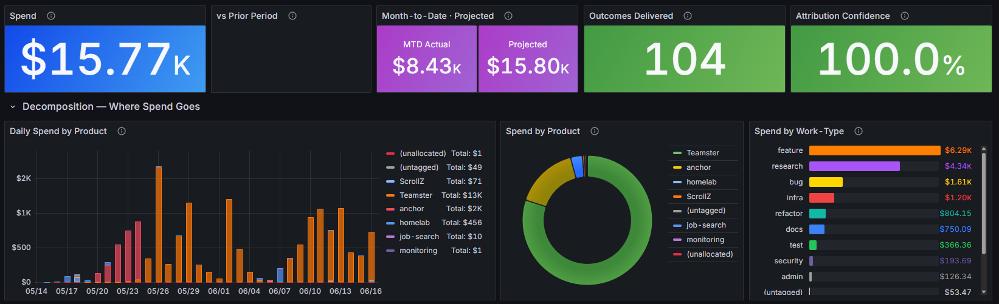
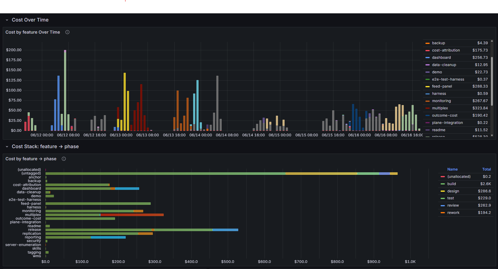
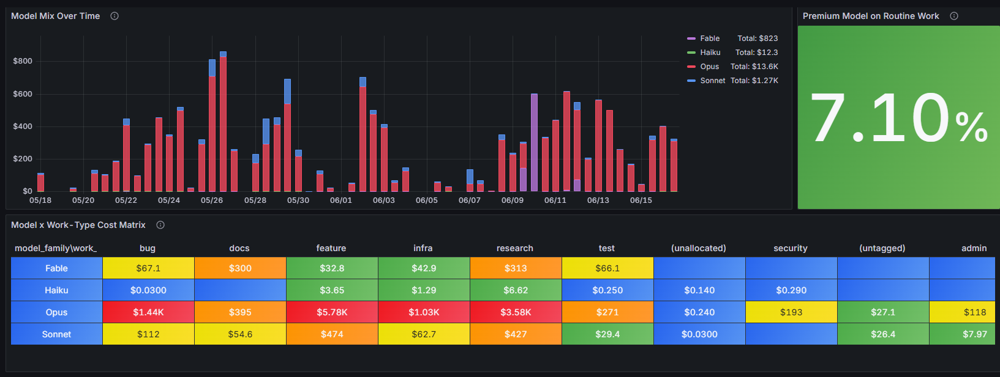
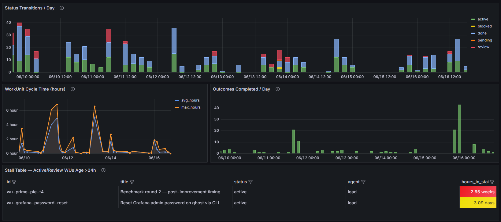
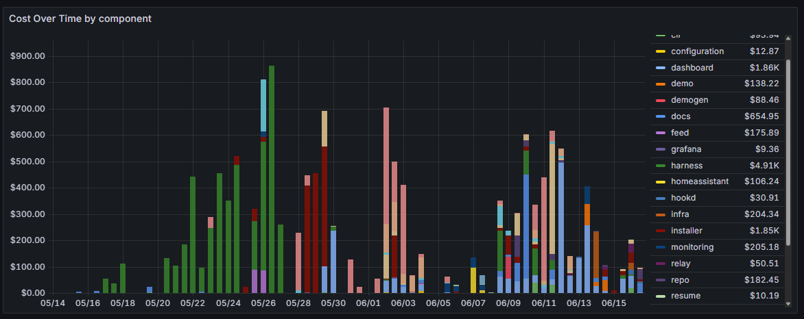
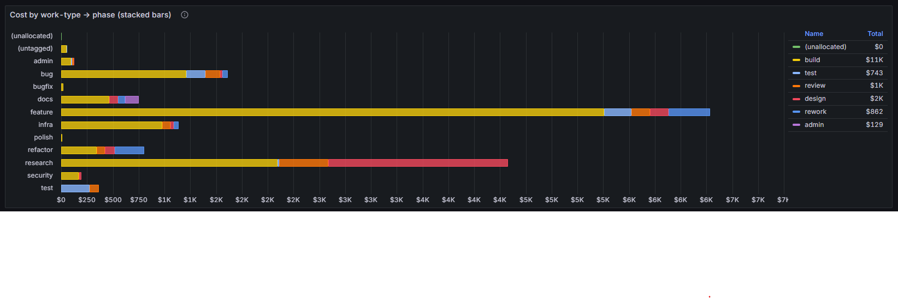
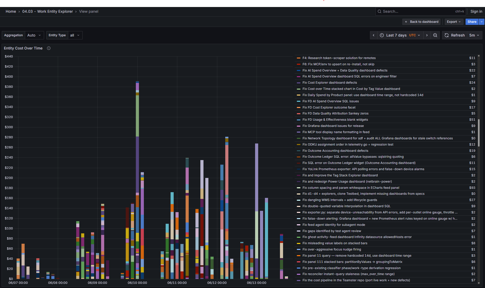
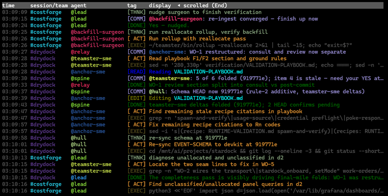

# Teamster

[](LICENSE)


Claude Code is great, but **using subagents and agent-teams effectively requires too much effort**
and you have almost **no visibility into what the agents are doing**.  What is worse, it is
nearly impossible to trustably link AI costs to business outcomes or to know if AI is being used effectively.

Teamster is a self-hosted observability and cost-attribution system for
Claude Code. It records what every agent does in real time, attributes
per-message token spend to declared work items, and presents both through
Grafana dashboards and a terminal activity feed. Every dollar lands somewhere
visible: attributed cost carries its attribution method, and whatever cannot
be attributed is shown as a residual, not hidden.



1. **Where is the AI spend going?** — by product, work type, component, phase
2. **Who is spending it?** — engineers, and the agents they run
3. **What outcomes is it producing?** — cost per delivered unit of work
4. **Is it being used effectively?** — model fit, rework share, cache
   economics, healthy team patterns

## What makes it useful

**Know what everything costs — by any dimension you care about.**
Tag your work with whatever matters to you: product, feature, work type,
component, team, engineer. Teamster joins per-message token spend to those
tags automatically. Change the tags later and the numbers update retroactively.

**Ask questions like:**
- "How much did we spend on feature X across all engineers?"
- "Which models produce the least rework per dollar?"
- "What share of our Opus spend goes to routine docs and tests?"
- "How much of this outcome's cost was design vs build vs rework?"
- "Which agents are bloating context and burning cache tokens?"

**See everything happening, live.**
A real-time activity stream — in your terminal or a web panel — shows what
every agent is reading, editing, running, and thinking, as it happens.
A team of agents stops being a black box behind the lead's summary.

**Let Teamster run the session.**
Type `/teamster:start` before your prompt and Teamster interviews you, recommends
team vs single-agent mode, sets up work tracking, and coaches the lead
on model selection, agent naming, and peer review — so you get the
orchestration benefits without memorizing the playbook.

## The dashboards

Eleven Grafana dashboards ship with Teamster. The first five are the ones you'll
use daily; the rest are specialized explorers and system health.

### AI Spend Explorer

The executive home page. Headline spend for the selected period with
period-over-period comparison, month-to-date projection, outcomes delivered,
and attribution confidence — all filterable by product, team, and engineer.
Below the headline: daily spend stacked by product, a pie chart breakdown,
and spend by work type. A "Who" section shows spend by engineer, by agent
team, and lead vs teammate split (a >60% lead share signals a coordination
anti-pattern). A live panel shows what's running right now.

### Cost Explorer

The deep analysis tool. Pick any three tag dimensions as facets — product,
work type, phase, component, engineer, or any custom key you've defined —
and the dashboard builds:

- A **Sankey flow diagram** showing how spend moves across your chosen
  dimensions (e.g. product → work type → phase)
- **Stacked time series** of cost by your primary facet
- A **cross-tabulation matrix** (facet 1 × facet 2) with drill-down filtering
- **Model mix** charts showing cost by model and over time
- **Cache economics**: hit ratio, estimated savings, cost-per-message trend

This is where you answer "how much did feature X cost" or "where is the
Opus spend going." Change the facet dropdowns and the whole dashboard
reconfigures instantly.



### AI Usage & Effectiveness

The efficiency dashboard. Answers "are we using AI well?"

- **Model fit**: model mix over time, a heat matrix of model × work type
  (instantly shows if expensive models are doing routine work), and a
  premium-model-on-routine-work percentage
- **Adoption**: spend by engineer, lead vs teammate cost ratio and trend,
  active agents per day, sessions per day
- **Flow**: status transitions, workunit cycle time, outcomes completed,
  stall table for stuck work
- **Rework tax**: rework + review share of attributed cost over time (rising =
  quality or coordination problems), phase cost breakdown table
- **Agent economics**: top agents by cost with context-bloat signals
  (high cache-read-per-message = agent is carrying too much context)





### Multidimension Cost Explorer

A composable OLAP tool. Pick any two tag dimensions as hierarchy levels
(e.g. product → work type, or component → phase) and instantly get:

- Stacked bar charts showing the full decomposition
- A cost matrix with heat-colored cells
- A drill-down table filtered to a specific Level 1 value
- Cost over time by your chosen dimension
- A **phase cost waterfall** (design → build → test → review → rework)
  with rework highlighted in red — the quickest way to see rework share
- Burn-rate projection from month-to-date daily cost





### Work Entity Explorer

Explore costs entity by entity — every outcome and work unit, individually.
A treemap visualization sizes rectangles by cost and colors them by status
(green = done, blue = active, yellow = review, red = blocked). Below it:
cost by entity over time, model breakdown, attribution coverage trend,
and per-agent cost with entity breadth (how many entities each agent touched).



### Outcome Accounting

Built to survive an invoice review. Total attributed spend, outcomes delivered,
mean cost per delivered outcome, and attribution confidence breakdown
(what fraction was direct join vs each recovery method). An outcome ledger
table gives one row per outcome sorted by cost — designed for export to a
spreadsheet or budget review. Drill into any single outcome to see its work
units, engineers, agents, phase mix, and duration.

### Other dashboards

| Dashboard | Purpose |
|-----------|---------|
| **Outcome Cost Explorer** | Per-outcome cost drill-down with agent and phase breakdown |
| **Realtime Activity Feed** | Live agent activity stream in Grafana (mirrors the terminal `feed`) |
| **Simple Cost Explorer** | Single-dimension cost breakdown — pick one tag key, see cost by its values |
| **Claude Code Metrics** | Anthropic's OTEL metrics: sessions, tokens, commits, PRs, active time, tool decisions |
| **System Health** | Pipeline health, attribution coverage, sweep freshness, tag hygiene, stale sessions |

## Real-time activity stream

Every agent's reads, edits, shell commands, plans, and completions stream
to two places as they happen:

- **`feed`** — a terminal viewer with color-coded entities (`@agent`, `#team`,
  `<model>`) and tool tags. Run it in a side terminal while your session works.
- **Web dashboard** — the same stream rendered in Grafana, with time-range
  selection and auto-refresh.

When you're running a team of 5 agents, `feed` is how you know what each one
is doing without reading the lead's token-expensive summaries.



## Quick start

```bash
git clone https://github.com/bmjdotnet/teamster.git && cd teamster
./install.sh             # interactive guided installer
teamster start           # start services
teamster setup tags      # define your reporting dimensions (guided TUI)
```

Then start a Claude Code session with:

```
/teamster:start <your prompt here>
```

Teamster interviews you, recommends an operating mode, sets up work tracking,
and you're running. Watch activity from a separate terminal with `feed`, or
open Grafana for the dashboards.

## How attribution works (briefly)

Agents declare what they're working on via built-in MCP tools. A pipeline
joins per-message token spend to the declared work item. Sessions that didn't
declare focus are recovered after the fact — deterministically from transcripts
and session shape, or with optional LLM-assisted synthesis. Every attributed
dollar records how it was attributed, so confidence is always inspectable.
A scheduled sweep runs all recovery passes automatically.

## Requirements

- **Linux** — required for the hub
- **macOS 10.13+** — supported as a remote only (see [Remote install](#remote-install))
- **Go 1.25+** — to build the binaries (hub install only)
- **MySQL or MariaDB** — backs the work-management store
- **Grafana** — local or external; the installer provisions dashboards either way
- **Claude Code CLI** (`claude`)
- **python3** — used by the installer for JSON parsing and config detection
- **unzip** — required for extracting Grafana plugin archives
- **Node.js / npm** — required for `ccusage` (token usage scraping)

The installer auto-installs missing apt packages (`curl`, `tar`, `unzip`,
`git`, `make`, `golang-go`, `nodejs`, `npm`) when running on a Debian/Ubuntu
host with sudo access.

A remote (client) install needs only **Python 3** and **Claude Code** — it runs
a lightweight hook client and points at a hub.

## Remote install

One hub runs the collector, database, and dashboards; any number of remote
hosts run only the Python hook client and participate in the same fabric:

```bash
teamster install-remote user@host
```

The hub's `TEAMSTER_HOOK_SERVER_URL` is written using the hub's **hostname**
(not `localhost`), and `teamster install-remote` derives the remote's `--server`
from it — so remotes get a hub address they can actually reach. If your hub URL
is still `localhost` (an older install), pass `--server <hub-host>:9125`
explicitly, or reinstall the hub to heal it.

**macOS hosts** are supported as remotes only. The hub installer hard-fails on
macOS — run it on your Linux hub instead, then enroll the Mac over SSH with
`teamster install-remote user@mac` from that hub. On macOS the token-scraper
runs as a launchd LaunchAgent rather than cron, and Agent-Teams teammates run as
separate top-level sessions, so the remote clients derive each teammate's
identity (and cost) from its transcript. See
[docs/specs/REMOTE-INSTALL.md](docs/specs/REMOTE-INSTALL.md) for details.

## Replication

A hub can push its data to one or more read-only **replica** hosts — a full
mirror (hookd, MySQL, Prometheus, Grafana) for DR/standby, staging,
stakeholder dashboards, or public-facing demos. The hub pushes events and
database state; the replica never connects back. See
[docs/specs/replication.md](docs/specs/replication.md).

## Backup and restore

Teamster can snapshot its data stores to timestamped directories and restore from them.

```bash
teamster backup          # take a backup now
teamster backup list     # list available backups (most recent first)
teamster backup status   # show timer status and last run
teamster restore <path>  # restore from a backup directory
teamster restore <path> --dry-run   # preview without restoring
teamster restore <path> --force     # skip confirmation
```

Set `backup.backup_dir` in `teamster.yaml`, then enable the timer:

```bash
sudo systemctl start teamster-backup.timer
```

What gets backed up is configurable per store (`mysql`, `grafana`, `otel`, `teamster`). Prometheus is opt-in (ephemeral data). Grafana is skipped in external mode. Retention defaults to 7 days (`backup.retention.keep_for`).

## Data & privacy

Everything stays on your infrastructure. Events, token counts, work items,
and costs are stored in your MySQL instance and served by your Grafana.
Nothing is sent to any third party. The only external API call is the optional
LLM-assisted recovery pass, which uses your own Anthropic credentials.

## Status

Early alpha, but built for multi-user environments and trustable data.


## CLI reference

| Command | Purpose |
|---------|---------|
| `teamster start` / `stop` / `status` | Manage services |
| `teamster version` | Print build version and exit |
| `teamster setup tags` | Guided tag vocabulary setup (TUI wizard) |
| `teamster tags list` / `add-key` / `add-value` / `retire` / `describe` | Non-interactive tag management |
| `teamster wms list` / `drain` / `close` | WMS entity management |
| `teamster sql` | Credential-safe database queries |
| `teamster backup` / `list` / `status` | Take a backup, list backups, show timer status |
| `teamster restore <path>` | Restore from a backup directory |
| `teamster install-remote user@host` | Install the client on a remote host |
| `feed` | Terminal activity viewer |
| `rollup --sweep` | Run the attribution pipeline manually |

## Slash commands

| Command | Purpose |
|---------|---------|
| `/teamster:start` | Front door — interview, mode selection, work tracking setup |
| `/teamster:solo` | Single-agent mode directly (skip the interview) |
| `/teamster:status` | Show team state and work items |
| `/teamster:tags` | Tag steward — refine vocabulary, merge, roll back |
| `/teamster:review` | Readiness assessment before presenting work |
| `/teamster:sweep` | Autonomous data-quality sweep |
| `/teamster:bootstrap` | Team bootstrap — spawns domain agents and wires the team (invoked by `/teamster:start`) |
| `/teamster:plan` | Collaborative planning — structure outcomes and work units (invoked by `/teamster:start`) |
| `/teamster:seasoning` | Iterative spec refinement — converge on a design through rounds of critique |

## Further reading

- [docs/quickstart.md](docs/quickstart.md) — fresh clone to running dashboard
- [docs/wizard.md](docs/wizard.md) — installer and tag setup walkthrough
- `skel/doc/specs/architecture.md` — system design and data flows
- [docs/specs/replication.md](docs/specs/replication.md) — read-only replica topology
- `skel/lib/plugin/skills/bootstrap/references/eight-rules.md` — the team protocol

These `skel/` paths are relative to the repo root. After installation, find
them under your Teamster base directory (default `~/teamster/`).

## License

Teamster is released under the [MIT License](LICENSE).
